# hscredit

<p align="center">
  
</p>

<div align="center">


<a href="https://pypi.org/project/hscredit/"></a>
<a href="https://hscredit.hengshucredit.com/"></a>


<p><strong>面向信贷风控的全流程量化工具箱</strong></p>
<p>🔍 鉴真伪 · 📊 斟信用 · ⚖️ 衡风险 · 🎯 枢定策</p>

</div>

## 为什么选择 hscredit？

`hscredit` 面向风控策略与模型研发，贯通数据探索、变量工程、评分建模、规则策略、模型监控和报告交付。统一的 `sklearn` 与 `scorecardpipeline` 风格 API、中文业务输出与 Excel 报告能力，让分析结果可以直接进入评审、汇报和归档流程。

| 能力域 | 能力规模 | 代表能力 | 业务价值与输出 |
|:---|:---:|:---|:---|
| 数据分析 | **57 种 EDA** | 数据质量、目标分布、坏率趋势、客群画像、Vintage、Roll Rate、策略仿真 | 快速判断样本质量、标签合理性与客群稳定性，输出 DataFrame、图表与分析报告 |
| 变量分箱 | **18 种分箱器** | 等频、等宽、卡方、树/CART、Best IV/KS/Lift、MDLP、单调、遗传算法、二维分箱 | 支持变量离散化、坏率趋势、单调性控制与评分卡开发 |
| 特征编码 | **9 种编码器** | WOE、Target、Count、OneHot、Ordinal、Quantile、CatBoost、Cardinality、GBM | 同时服务评分卡、树模型和高基数类别变量处理 |
| 特征筛选 | **23 种筛选器** | 缺失率、众数率、方差、相关性、VIF、IV、Lift、PSI、RFE、Boruta、逐步回归、组合筛选 | 从区分度、稳定性、共线性、贡献度与业务解释多角度筛选变量 |
| 风控指标 | **43 种指标** | KS、AUC、Gini、Lift、坏样本率、IV、PSI、CSI、分箱统计、分类与回归指标 | 建模、变量、策略和监控使用统一指标口径 |
| 模型训练 | **38 个建模组件** | 逻辑回归、ScoreCard、RandomForest、DecisionTree、SVM、GBDT、XGBoost、LightGBM、CatBoost、NGBoost、风控损失、调参 | 覆盖传统评分卡、机器学习风控模型与业务目标导向建模 |
| 可视化分析 | **46 种图表** | 分箱趋势、KS/ROC/PR/Lift/Gain、评分分布、策略阈值、Vintage、稳定性、客群漂移、树图 | 将分析结论直接转为评审、沟通和复盘材料 |
| 报告交付 | **28 种报告工具** | 特征分析、规则分析、Swap、逾期预测、模型报告、模型对比 | 输出中文明细表、图表与多 Sheet Excel 报告 |
| Excel 报表 | **10+ 种 Excel 操作** | 数据写入、图片、超链接、条件格式、样式、数字格式、冻结窗格、列宽、Sheet 复制 | 生成可直接评审、汇报和归档的样式化报表 |
| 规则挖掘 | **8 种挖掘工具** | 单变量规则、多变量交叉规则、多标签规则、树规则提取、手工树、规则指标 | 从数据和模型中发现可解释的风险模式 |
| Rule 规则体系 | **8 类规则能力** | Rule 表达式、任意层级嵌套、与/或/非、变量解析、命中评估、规则集、SWAP 分析 | 将零散策略条件沉淀为可组合、可评估、可追踪的规则资产 |

> **核心优势：** 信贷业务原生 · `sklearn` 与 `scorecardpipeline` 双 API · 中文指标与报告 · 评分卡/机器学习/规则统一 · 分析结果可直接交付

## 从数据到决策交付的完整链路

<p align="center">
  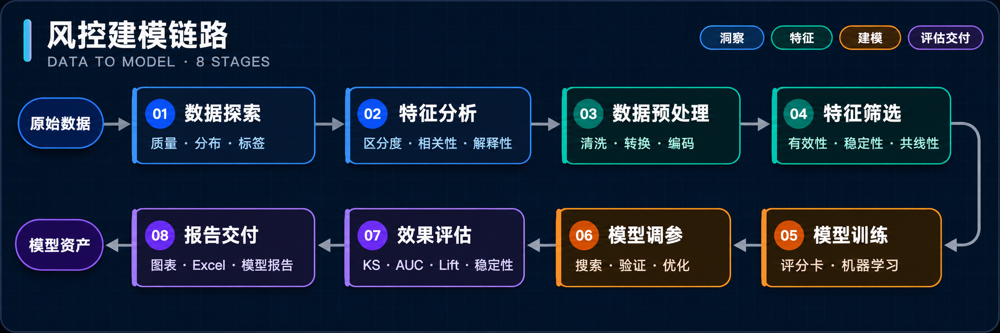
</p>

<p align="center">
  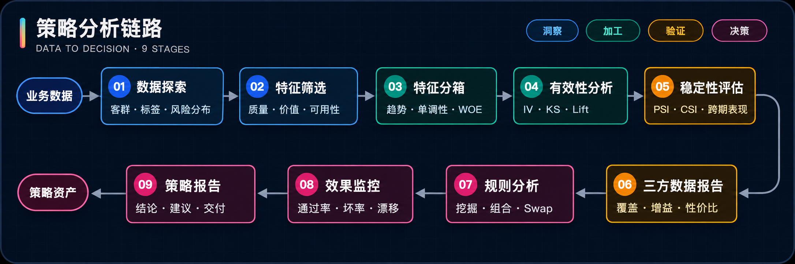
</p>

## 核心能力实战展示

所有代码示例共用下面的数据准备步骤。运行一次后，可以独立展开任意 API 示例。

<details>
<summary><strong>公共数据准备</strong></summary>

```python
import hscredit
import numpy as np
import pandas as pd
from sklearn.model_selection import train_test_split

hscredit.init_setting()
df = pd.read_excel("examples/hscredit_yyp.xlsx")
df["target"] = df["FPD"].astype(int)
df["date"] = pd.to_datetime(df["放款时间"])

features = [
    "青云24",
    "天创小额网贷分",
    "近六个月非银多头机构数",
    "手机号近一个月非银多头机构数",
    "身份证近一个月非银多头机构数",
    "衡枢鉴真分老客版",
]
X = df[features].apply(pd.to_numeric, errors="coerce")
X = X.fillna(X.median())
y = df["target"]
X_train, X_test, y_train, y_test = train_test_split(
    X, y, test_size=0.25, stratify=y, random_state=42
)

monitor_table = (
    df.assign(月份=df["date"].dt.to_period("M").astype(str))
    .groupby("月份", as_index=False)
    .agg(
        放款笔数=("客户编号", "size"),
        放款金额=("放款金额", "sum"),
        MOB1_DPD7率=("MOB1", lambda x: (x > 7).mean()),
        当前DPD30率=("CURRENT_DPD", lambda x: (x > 30).mean()),
    )
)
```

</details>

> **信贷业务原生口径：** `overdue + dpds` 可由逾期天数字段生成多 DPD 标签；`amount` 同时评估放款金额/风险敞口；`margins=True` 追加合计；`prior_rules` 先处理存量策略或限定客群，再评价当前规则。

### 1. 分析报告：指标、图表与 Excel 一次交付

| API | 核心能力 | 主要输出 |
|:---|:---|:---|
| `auto_feature_analysis` | 变量质量、分箱、跨期稳定性 | 带表格和图表的 Excel |
| `ruleset_analysis` | 规则集命中、坏率、Lift、金额口径 | 多 DPD 规则效果表 |
| `rule_swap_analysis` | 策略置入/置出前后的通过率和风险变化 | 流水线表、置换结果表 |
| `ManualTreeExtractor` | 将人工经验切点注入可执行决策树 | 叶节点规则表、Rule 对象 |
| `plot_tree_matplotlib` | 将 sklearn/hscredit 树转为可解释图 | Matplotlib Figure |
| `auto_model_report` | KS/AUC/PSI、Lift、排序性、变量表现 | 带图表的多 Sheet Excel |

#### `auto_feature_analysis`

整合样本分布、变量质量、分箱表现、跨期稳定性和多 DPD 金额口径。

<details>
<summary>代码示例：<code>auto_feature_analysis</code></summary>

```python
from hscredit.excel import ExcelWriter
from hscredit.report import auto_feature_analysis

writer = ExcelWriter()
auto_feature_analysis(
    df,
    features=features[:3],
    overdue=["MOB1", "CURRENT_DPD"],
    dpds=[30, 7, 3, 0],
    date="date",
    amount="放款金额",
    margins=True,
    excel_writer=writer,
    pictures=["bin", "ks", "hist"],
)
writer.save("特征分析报告.xlsx")
```

</details>

<p align="center"><a href="docs/assets/readme/api-gallery/report-auto-feature-analysis-overview.png">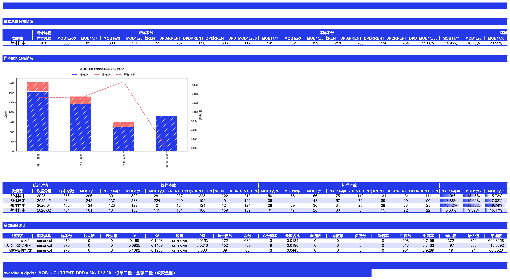</a></p>

<p align="center"><sub>订单口径 + 图表</sub><br><a href="docs/assets/readme/api-gallery/report-auto-feature-analysis-order.png">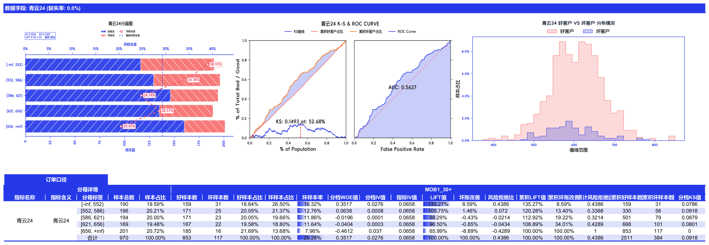</a></p>

<p align="center"><sub>金额口径</sub><br><a href="docs/assets/readme/api-gallery/report-auto-feature-analysis-amount.png">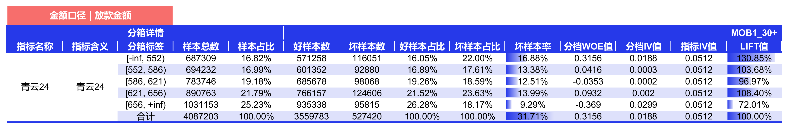</a></p>

#### `ruleset_analysis`

对比多个规则的命中规模、坏样本率、Lift 和金额表现。

<details>
<summary>代码示例：<code>ruleset_analysis</code></summary>

```python
from hscredit.core.rules import Rule
from hscredit.report import ruleset_analysis

rules = [
    Rule("青云24 < 560", name="低评分"),
    Rule("近六个月非银多头机构数 >= 55", name="高多头"),
]
report = ruleset_analysis(
    df,
    rules,
    overdue="MOB1",
    dpds=[7, 3, 0],
    amount="放款金额",
    margins=True,
)
```

</details>

| 规则/阶段 | 金额口径 | MOB1 7+ 坏样本率 | MOB1 7+ Lift | MOB1 3+ 坏样本率 | MOB1 0+ 坏样本率 |
|:---|---:|---:|---:|---:|---:|
| 原始样本 | `4,087,203` | `15.13%` | `1.00` | `16.33%` | `20.45%` |
| `青云24 < 560` | `840,691` | `18.78%` | `1.24` | `20.77%` | `25.57%` |
| `近六个月非银多头机构数 >= 55` | `2,256,786` | `15.70%` | `1.11` | `16.85%` | `19.92%` |

#### `rule_swap_analysis`

评估策略规则置入、置出前后的通过率与风险变化。

<details>
<summary>代码示例：<code>rule_swap_analysis</code></summary>

```python
from hscredit.core.rules import Rule
from hscredit.report import rule_swap_analysis

swap = rule_swap_analysis(
    data=df,
    score="青云24",
    rules_in=[Rule("近六个月非银多头机构数 < 45", name="低多头置入")],
    rules_out=[Rule("CURRENT_DPD >= 30", name="高逾期置出")],
    overdue="MOB1",
    dpds=[7, 3, 0],
    amount="放款金额",
)
```

</details>

| 指标 | 变化前 | 变化后 | 绝对变化 | 相对变化 |
|:---|---:|---:|---:|---:|
| 通过率 | `315,317.53` | `37,655.57` | `-277,661.96` | `-88.06%` |
| 逾期率 | `2.17%` | `15.96%` | `+13.79%` | `+6.36x` |
| 风险上浮系数 | `1.00` | `2.00` | `+1.00` | `+100.00%` |

#### `ManualTreeExtractor`

将业务经验切点加入决策树，并导出叶节点规则。

<details>
<summary>代码示例：<code>ManualTreeExtractor</code></summary>

```python
from hscredit.report.mining import ManualTreeExtractor

tree = ManualTreeExtractor(
    target="target",
    features="青云24",
    feature_map={"青云24": "青云信用评分"},
    max_depth=3,
    min_samples_leaf=25,
)
tree.fit(df, feature_names=features[:3])
tree.manual_split(df, feature="青云24", threshold=600, node=0)
rules = tree.get_rule_table(df, target="target", amount="放款金额", leaf_only=True)
```

</details>

| 节点 | 叶节点 | 入参字段 | 字段含义 | 人工规则 | 样本金额 | 坏样本率 | Lift | 风险拒绝比 |
|---:|:---:|:---|:---|:---|---:|---:|---:|---:|
| `1` | 是 | `青云24` | 青云信用评分 | `青云24 <= 600` | `1,724,221` | `16.89%` | `1.1892` | `0.3273` |
| `2` | 是 | `青云24` | 青云信用评分 | `青云24 > 600（含缺失）` | `2,362,982` | `12.24%` | `0.8619` | `-0.3273` |

#### `plot_tree_matplotlib`

<details>
<summary>代码示例：<code>plot_tree_matplotlib</code></summary>

```python
from sklearn.tree import DecisionTreeClassifier
from hscredit.core.viz import plot_tree_matplotlib

tree_model = DecisionTreeClassifier(max_depth=3, min_samples_leaf=25, random_state=42)
tree_model.fit(X_train, y_train)
figure = plot_tree_matplotlib(
    tree_model,
    feature_names=features,
    title="风险决策树",
)
```

</details>

<p align="center"><a href="docs/assets/readme/api-gallery/report-plot-tree-matplotlib.png">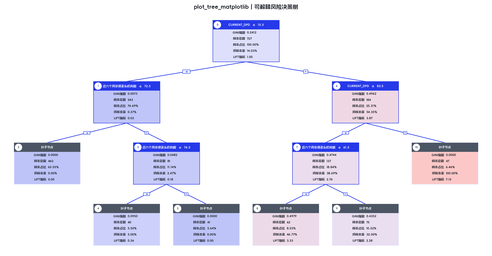</a></p>

#### `auto_model_report`

汇总训练集与验证集的 KS、AUC、PSI、Lift、排序性、变量表现和金额口径。

<details>
<summary>代码示例：<code>auto_model_report</code></summary>

```python
from sklearn.linear_model import LogisticRegression
from hscredit.report import auto_model_report

model = LogisticRegression(max_iter=1000).fit(X_train, y_train)
report_columns = features + ["MOB1", "CURRENT_DPD", "放款金额", "date"]
auto_model_report(
    model,
    datasets={
        "建模集": df.loc[X_train.index, report_columns],
        "验证集": df.loc[X_test.index, report_columns],
    },
    overdue=["MOB1", "CURRENT_DPD"],
    dpds=[30, 7, 3, 0],
    amount_col="放款金额",
    date_col="date",
    feature_names=features,
    method="predict_proba",  # 每个数据集只调用这一个方法
    excel_path="模型报告.xlsx",
    with_plots=True,
)

# callable 中 self 是最终返回的 ModelReport，模型通过 self.model 访问
custom_report = auto_model_report(
    model,
    X_train=X_test,
    y_train=y_test,
    method=lambda self, x, scale: self.model.predict_proba(x)[:, 1] * scale,
    scale=100,
    verbose=False,
)
```

</details>

<p align="center"><sub>多 DPD 样本概览</sub><br><a href="docs/assets/readme/api-gallery/report-auto-model-report-overview.png">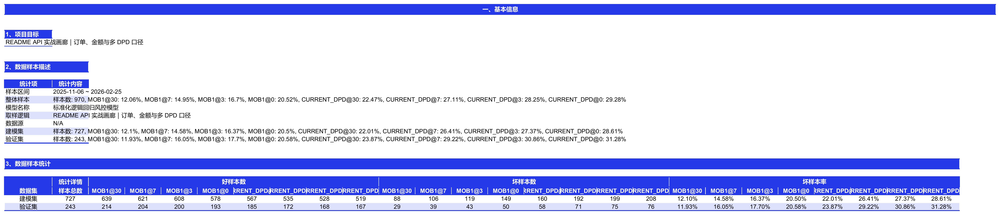</a></p>

<p align="center"><a href="docs/assets/readme/api-gallery/report-auto-model-report-performance.png">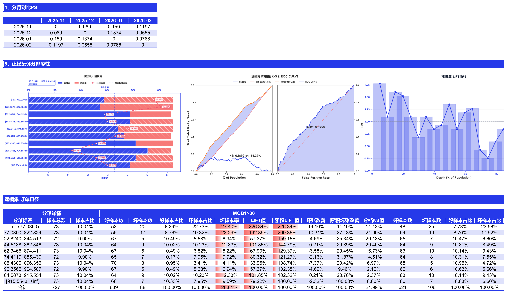</a></p>

<p align="center"><sub>金额口径</sub><br><a href="docs/assets/readme/api-gallery/report-auto-model-report-amount.png">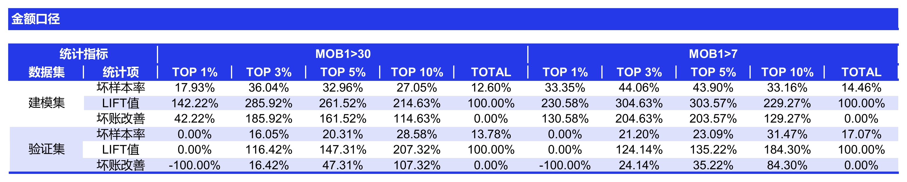</a></p>

`ModelReport` 不自动创建评分转换器，也不额外预测概率；指标、分箱和 PSI 全部使用 `method` 单次调用的结果。

### 2. 数据分析与 pandas 扩展

导入 `hscredit` 后即可使用 DataFrame 分析、Excel 输出和链式并行扩展；`feature_summary` 也可作为独立函数调用。

<details>
<summary>代码示例：<code>DataFrame.hscredit.apply</code></summary>

```python
result = df[features].hscredit.apply(np.sum, axis=1)
mapped = df["放款金额"].hscredit(n_jobs=4).apply(np.log1p)
```

</details>

并行后端、任务预算与回退规则详见[并行执行契约](docs/parallelism.md#pandas-apply-并行扩展)。

#### `pd.DataFrame.summary`

<details>
<summary>代码示例：<code>pd.DataFrame.summary</code></summary>

```python
summary = df.summary(
    features=features,
    y="target",
    max_n_bins=5,
    psi_method="date_col",
    psi_date_col="date",
    psi_freq="M",
)
```

</details>

| 特征名 | 字段类型 | 样本数 | 缺失率 | IV | KS | PSI | 唯一值数 |
|:---|:---:|---:|---:|---:|---:|---:|---:|
| 青云24 | numerical | `970` | `0.00%` | `0.0546` | `0.1399` | `0.1297` | `272` |
| 天创小额网贷分 | numerical | `970` | `0.00%` | `0.0294` | `0.1075` | `0.0403` | `152` |
| 近六个月非银多头机构数 | numerical | `970` | `0.00%` | `0.0649` | `0.1153` | `0.0301` | `69` |
| 衡枢鉴真分老客版 | id | `970` | `0.00%` | `0.1860` | `0.1840` | `0.0316` | `970` |

#### `feature_summary`

<details>
<summary>代码示例：<code>feature_summary</code></summary>

```python
from hscredit.core.eda import feature_summary

summary = feature_summary(
    df,
    features=features,
    y="target",
    psi_method="date_col",
    psi_date_col="date",
    psi_freq="M",
)
```

</details>

| 特征名 | 平均值 | 标准差 | IV | KS | PSI | 趋势 |
|:---|---:|---:|---:|---:|---:|:---:|
| 青云24 | `604.33` | `64.93` | `0.0546` | `0.1399` | `0.1297` | unknown |
| 天创小额网贷分 | `710.34` | `52.54` | `0.0294` | `0.1075` | `0.0403` | valley |
| 近六个月非银多头机构数 | `60.85` | `12.13` | `0.0649` | `0.1153` | `0.0301` | unknown |
| 衡枢鉴真分老客版 | `0.0946` | `0.0524` | `0.1860` | `0.1840` | `0.0316` | unknown |

#### `pd.DataFrame.save`

将 DataFrame、数字格式、条件格式和图表写入样式化 Excel。

<details>
<summary>代码示例：<code>pd.DataFrame.save</code></summary>

```python
monitor_table.save(
    "特征摘要.xlsx",
    sheet_name="特征摘要",
    title="特征质量与跨期稳定性",
    condition_cols=["放款金额"],
    percent_cols=["MOB1_DPD7率", "当前DPD30率"],
    auto_width=True,
    index=False,
)
```

</details>

<p align="center"><a href="docs/assets/readme/api-gallery/pandas-dataframe-save.png">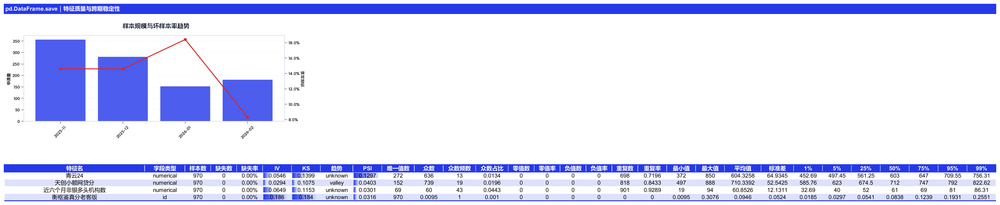</a></p>

### 3. 分箱与分箱分析

#### `OptimalBinning`

<details>
<summary>代码示例：<code>OptimalBinning</code></summary>

```python
from hscredit.core.binning import OptimalBinning

binner = OptimalBinning(method="best_iv", max_n_bins=5, min_bin_size=0.05)
binner.fit(X_train, y_train)
bin_table = binner.get_bin_table("青云24")
X_woe = binner.transform(X_test, metric="woe")
```

</details>

| 分箱标签 | 样本数 | 样本占比 | 坏样本率 | WOE | IV | KS |
|:---|---:|---:|---:|---:|---:|---:|
| `[-inf, 552.00)` | `190` | `19.59%` | `18.42%` | `0.3255` | `0.0808` | `0.0715` |
| `[552.00, 609.57)` | `324` | `33.40%` | `16.36%` | `0.1818` | `0.0808` | `0.1363` |
| `[609.57, 656.00)` | `255` | `26.29%` | `10.98%` | `-0.2792` | `0.0808` | `0.0700` |
| `[656.00, +inf)` | `201` | `20.72%` | `9.95%` | `-0.3892` | `0.0808` | `0.0000` |

#### `feature_bin_stats`：多 DPD + 金额口径 + 合计

<details>
<summary>代码示例：<code>feature_bin_stats</code></summary>

```python
from hscredit.report import feature_bin_stats

bin_table = feature_bin_stats(
    df,
    feature="青云24",
    overdue="MOB1",
    dpds=[7, 3, 0],
    amount="放款金额",
    margins=True,
    method="best_iv",
    max_n_bins=5,
)
```

</details>

| 分箱 | 放款金额 | MOB1 7+ 坏样本率 / Lift | MOB1 3+ 坏样本率 / Lift | MOB1 0+ 坏样本率 / Lift |
|:---|---:|---:|---:|---:|
| `[-inf, 552.00)` | `687,309` | `20.44% / 1.35` | `21.63% / 1.32` | `26.31% / 1.29` |
| `[552.00, 609.57)` | `1,191,582` | `18.22% / 1.20` | `19.31% / 1.18` | `22.39% / 1.09` |
| `[609.57, 673.03)` | `1,534,445` | `12.93% / 0.85` | `14.11% / 0.86` | `19.31% / 0.94` |
| `[673.03, +inf)` | `673,867` | `9.24% / 0.61` | `10.70% / 0.66` | `13.64% / 0.67` |

#### `feature_binning_summary`

<details>
<summary>代码示例：<code>feature_binning_summary</code></summary>

```python
from hscredit.report import feature_binning_summary

details, summary = feature_binning_summary(
    df,
    feature=features[:2],
    methods=["quantile", "cart", "best_iv"],
    target="target",
    max_n_bins=5,
    margins=True,
)
```

</details>

| 分箱方法 | 指标 | KS | Lift | IV | 坏样本数 | 坏样本率 |
|:---|:---|---:|---:|---:|---:|---:|
| quantile | 青云24 | `0.0930` | `1.31` | `0.0546` | `136` | `14.02%` |
| quantile | 天创小额网贷分 | `0.0674` | `1.17` | `0.0294` | `136` | `14.02%` |
| cart | 青云24 | `0.1375` | `1.37` | `0.0866` | `136` | `14.02%` |
| cart | 天创小额网贷分 | `0.1074` | `1.28` | `0.0500` | `136` | `14.02%` |

#### `feature_group_binning_summary`

<details>
<summary>代码示例：<code>feature_group_binning_summary</code></summary>

```python
from hscredit.report import feature_group_binning_summary

details, summary = feature_group_binning_summary(
    df,
    feature=features[:2],
    methods=["quantile", "cart"],
    date_col="date",
    freq="M",
    target="target",
    max_n_bins=5,
    margins=True,
)
```

</details>

| 方法 | 指标 | 分组 | KS | Lift | IV | 坏样本率 |
|:---|:---|:---:|---:|---:|---:|---:|
| quantile | 青云24 | `2025-11` | `0.1402` | `1.24` | `0.1720` | `14.61%` |
| quantile | 青云24 | `2025-12` | `0.0705` | `1.26` | `0.0362` | `14.59%` |
| quantile | 青云24 | `2026-01` | `0.2166` | `2.00` | `0.2678` | `18.42%` |
| quantile | 青云24 | `2026-02` | `0.1470` | `1.51` | `0.4949` | `8.29%` |

<details>
<summary>代码示例：<code>bin_plot</code></summary>

```python
from hscredit.core.viz import bin_plot
from hscredit.report import feature_bin_stats

bin_table = feature_bin_stats(df, feature="青云24", target="target", margins=True)
figure = bin_plot(bin_table, desc="青云24", title="样本结构与坏样本率")
```

</details>

<details>
<summary>代码示例：<code>bin_trend_plot</code></summary>

```python
from hscredit.core.viz import bin_trend_plot

figure = bin_trend_plot(
    df,
    feature="青云24",
    target="target",
    date_col="date",
    date_freq="M",
    method="quantile",
    max_n_bins=5,
)
```

</details>

<details>
<summary>代码示例：<code>bin_2d_plot</code></summary>

```python
from hscredit.core.viz import bin_2d_plot

figure = bin_2d_plot(
    df,
    features=["青云24", "近六个月非银多头机构数"],
    target="target",
    method="quantile",
    max_n_bins=5,
)
```

</details>

<details>
<summary>代码示例：<code>feature_efficiency_analysis</code></summary>

```python
from hscredit.report import feature_efficiency_analysis

result = feature_efficiency_analysis(
    df,
    feature="青云24",
    target="target",
    date_col="date",
    auto_method="quantile",
    max_n_bins=5,
)
figure = result["comparison_figure"]
```

</details>

<table>
<tr>
<td width="50%" valign="top"><strong><code>bin_plot</code></strong><br><sub>单变量样本结构、坏率和分箱指标。</sub><br><a href="docs/assets/readme/api-gallery/binning-bin-plot.png">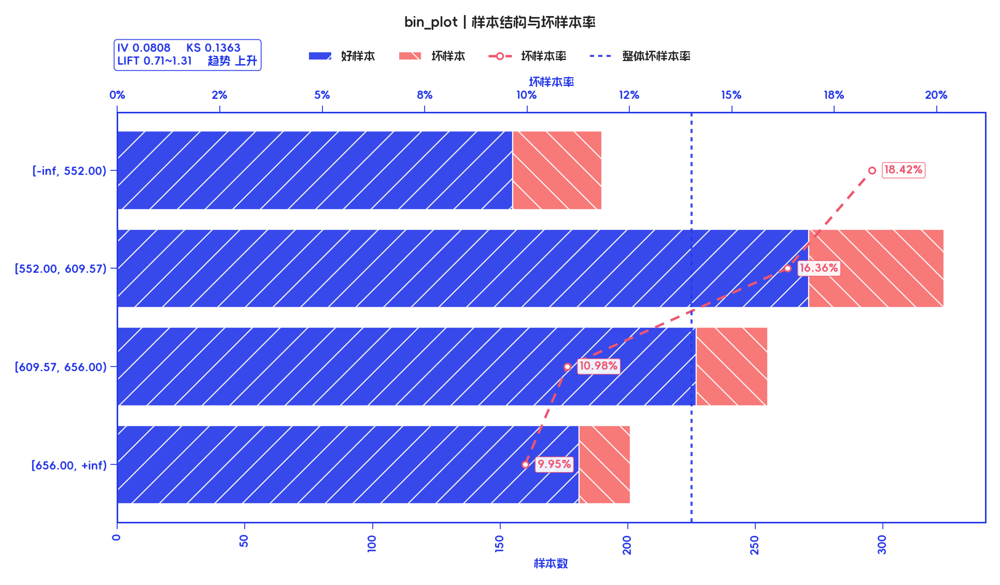</a></td>
<td width="50%" valign="top"><strong><code>bin_trend_plot</code></strong><br><sub>跨月份分箱坏率趋势与稳定性。</sub><br><a href="docs/assets/readme/api-gallery/binning-bin-trend-plot.png">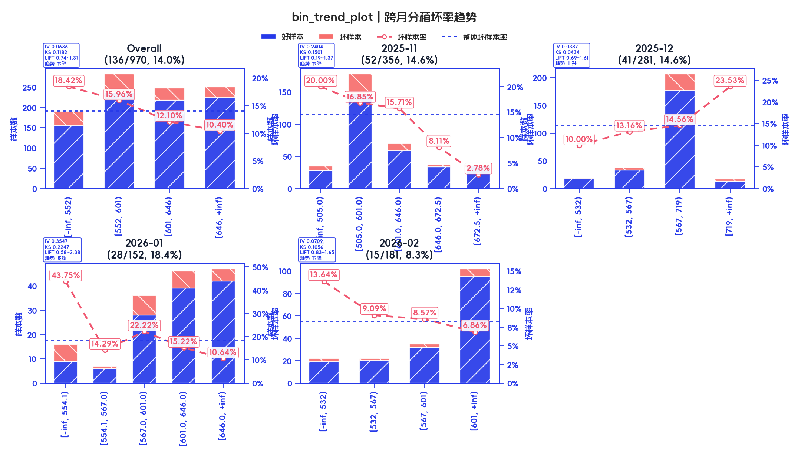</a></td>
</tr>
<tr>
<td width="50%" valign="top"><strong><code>bin_2d_plot</code></strong><br><sub>两个变量交叉后的二维风险热力图。</sub><br><a href="docs/assets/readme/api-gallery/binning-bin-2d-plot.png">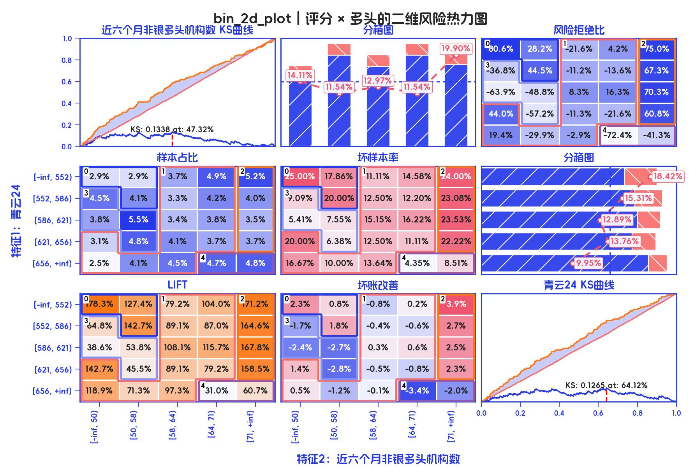</a></td>
<td width="50%" valign="top"><strong><code>feature_efficiency_analysis</code></strong><br><sub>手工切点、自动分箱、KS 与 ROC 一体对比。</sub><br><a href="docs/assets/readme/api-gallery/binning-feature-efficiency-analysis.png">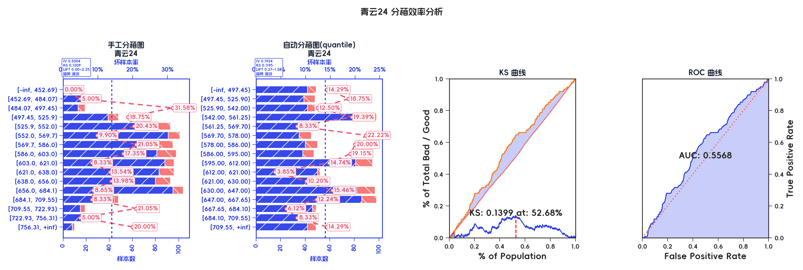</a></td>
</tr>
</table>

### 4. 特征筛选与过程追踪

<details>
<summary>代码示例：<code>NullImportanceSelector</code></summary>

```python
from sklearn.ensemble import RandomForestClassifier
from hscredit.core.selectors import NullImportanceSelector

selector = NullImportanceSelector(
    estimator=RandomForestClassifier(n_estimators=100, random_state=42),
    threshold=0.0,
    cv=3,
    n_runs=5,
)
X_selected = selector.fit_transform(X_train, y_train)
report = selector.get_selection_report_df()
```

</details>

<details>
<summary>代码示例：<code>BorutaSelector</code></summary>

```python
from sklearn.ensemble import RandomForestClassifier
from hscredit.core.selectors import BorutaSelector

selector = BorutaSelector(
    estimator=RandomForestClassifier(n_estimators=100, max_depth=5, random_state=42),
    n_estimators=100,
    max_iter=20,
    random_state=42,
)
X_selected = selector.fit_transform(X_train, y_train)
report = selector.get_selection_report_df()
```

</details>

<details>
<summary>代码示例：<code>RFESelector</code></summary>

```python
from sklearn.linear_model import LogisticRegression
from hscredit.core.selectors import RFESelector

selector = RFESelector(
    LogisticRegression(max_iter=1000),
    n_features_to_select=5,
    step=1,
)
X_selected = selector.fit_transform(X_train, y_train)
report = selector.get_selection_report_df()
```

</details>

<details>
<summary>代码示例：<code>CompositeFeatureSelector</code></summary>

```python
from hscredit.core.selectors import CompositeFeatureSelector, CorrSelector, IVSelector, NullSelector

selector = CompositeFeatureSelector(
    [
        ("缺失", NullSelector(threshold=0.95)),
        ("IV", IVSelector(threshold=0.02)),
        ("相关性", CorrSelector(threshold=0.85)),
    ],
    strategy="sequential",
)
X_selected = selector.fit_transform(X_train, y_train)
report = selector.get_selection_report_df()
```

</details>

<details>
<summary>代码示例：<code>ScorecardFeatureSelection</code></summary>

```python
from hscredit.core.selectors import ScorecardFeatureSelection

selector = ScorecardFeatureSelection(
    null_threshold=0.95,
    mode_threshold=0.98,
    iv_threshold=0.02,
    corr_threshold=0.85,
    binning_params={"method": "quantile", "max_n_bins": 5},
)
X_selected = selector.fit_transform(X_train, y_train)
report = selector.get_selection_report_df()
```

</details>

<details>
<summary>代码示例：<code>SelectionReportCollector</code></summary>

```python
from hscredit.core.selectors import IVSelector, NullSelector, SelectionReportCollector

collector = SelectionReportCollector(name="特征筛选流程")
current = X_train
for selector in [NullSelector(threshold=0.95), IVSelector(threshold=0.02)]:
    selector.fit(current, y_train)
    collector.add_report(selector)
    current = selector.transform(current)

summary = collector.to_dataframe()
feature_trace = collector.get_feature_trace()
```

</details>

| API | 输入特征 | 保留特征 | 结果摘要 |
|:---|---:|---:|:---|
| `NullImportanceSelector` | `6` | `3` | 模型重要性超过随机标签基线 |
| `BorutaSelector` | `6` | `2` | 与 Shadow Features 对照筛选 |
| `RFESelector` | `6` | `5` | 递归消除至目标变量数 |
| `CompositeFeatureSelector` | `6` | 分阶段 | 缺失率 → IV → 相关性顺序漏斗 |
| `ScorecardFeatureSelection` | `6` | `5` | 缺失、集中度、IV、相关性联合粗筛 |
| `SelectionReportCollector` | `4` 个阶段 | `1` 份报告 | 汇总阶段结果并追踪变量去向 |

`CompositeFeatureSelector` 的逐轮明细直接返回 DataFrame：

| 特征 | 轮次 | 筛选器 | 策略 | 状态 | 得分 | 本轮输入 | 本轮输出 |
|:---|---:|:---|:---:|:---:|---:|---:|---:|
| 天创小额网贷分 | `1` | NullSelector | sequential | 选中 | `0.0000` | `6` | `6` |
| 近六个月非银多头机构数 | `1` | NullSelector | sequential | 选中 | `0.0000` | `6` | `6` |
| 天创小额网贷分 | `2` | IVSelector | sequential | 选中 | `1.28` | `6` | `6` |
| 青云24 | `2` | IVSelector | sequential | 选中 | `1.75` | `6` | `6` |

`SelectionReportCollector` 汇总多个筛选器后仍保留阶段边界：

| 阶段 | 筛选器 | 阈值 | 输入特征数 | 选中特征数 | 剔除特征数 |
|:---|:---|---:|---:|---:|---:|
| 阶段1 | VarianceSelector | `0.00` | `6` | `6` | `0` |
| 阶段2 | NullSelector | `0.95` | `6` | `6` | `0` |
| 阶段3 | IVSelector | `0.00` | `6` | `6` | `0` |
| 阶段4 | CorrSelector | `0.85` | `6` | `6` | `0` |

### 5. Rule：任意嵌套、先验规则与多业务口径

<details>
<summary>代码示例：<code>Rule</code> 交、并、非与多层嵌套</summary>

```python
from hscredit.core.rules import Rule

score_rule = Rule("青云24 < 580", name="评分偏低")
multi_rule = Rule("近六个月非银多头机构数 >= 55", name="多头偏高")
dpd_rule = Rule("CURRENT_DPD >= 30", name="当前逾期")
whitelist = Rule("衡枢鉴真分老客版 < 0.03", name="低风险白名单")

rule = (score_rule & multi_rule) | (dpd_rule & ~whitelist)
hit_mask = rule.predict(df)
```

</details>

<details>
<summary>代码示例：<code>Rule.report</code></summary>

```python
from hscredit.core.rules import Rule

prior = Rule("商品类别 == '礼包'", name="存量先验规则")
rule = (Rule("青云24 < 580") & Rule("近六个月非银多头机构数 >= 55")) | Rule(
    "CURRENT_DPD >= 30"
)
report = rule.report(
    df,
    overdue="MOB1",
    dpds=[7, 3, 0],
    prior_rules=prior,
    amount="放款金额",
    margins=True,
)
```

</details>

交、并、非和多层嵌套均保持为可执行 `Rule` 对象：

| 青云24 | 六月多头数 | CURRENT_DPD | 目标 | 组合规则结果 |
|---:|---:|---:|---:|:---:|
| `656` | `51` | `0` | `0` | 未命中 |
| `565` | `56` | `0` | `0` | 命中 |
| `708` | `68` | `0` | `0` | 未命中 |
| `555` | `45` | `0` | `0` | 未命中 |

`prior_rules`、`amount`、`margins` 与多 DPD 可以在一次报告中组合：

| 规则分类 | 口径 | 分箱 | 总量 | MOB1 7+ 坏样本率 / Lift | MOB1 3+ 坏样本率 / Lift | MOB1 0+ 坏样本率 / Lift |
|:---|:---:|:---:|---:|---:|---:|---:|
| 先验规则 | 订单 | 命中 | `189` | `13.23% / 0.88` | `16.93% / 1.01` | `19.58% / 0.95` |
| 先验规则 | 订单 | **合计** | `970` | `14.95% / 1.00` | `16.70% / 1.00` | `20.52% / 1.00` |
| 验证规则 | 订单 | 命中 | `333` | `33.33% / 2.17` | `34.53% / 2.07` | `39.04% / 1.88` |
| 先验规则 | 金额 | 命中 | `262,527` | `13.23% / 0.88` | `16.94% / 1.04` | `19.58% / 0.96` |
| 先验规则 | 金额 | **合计** | `4,087,203` | `15.13% / 1.00` | `16.33% / 1.00` | `20.45% / 1.00` |
| 验证规则 | 金额 | 命中 | `1,517,099` | `35.49% / 2.33` | `36.57% / 2.25` | `41.51% / 2.02` |

### 6. 模型、风控 Loss 与统一调优

> **破坏性命名变更：** 七个具体模型现已统一使用 `XGBoost`、`LightGBM`、`CatBoost`、`NGBoost`、`RandomForest`、`ExtraTrees` 和 `GradientBoosting`。不再提供旧 `RiskModel` 后缀类名。引用旧类路径的 pickle、joblib 或 JSON 制品需先用旧版 hscredit 加载并重新训练或导出，再升级使用。

#### Boosting

统一 `fit / predict_proba / evaluate`，同时输出评估指标和特征贡献。

<details>
<summary>代码示例：<code>GradientBoosting</code></summary>

```python
from hscredit.core.models import GradientBoosting

model = GradientBoosting(
    n_estimators=100,
    learning_rate=0.05,
    max_depth=3,
    random_state=42,
)
model.fit(X_train, y_train)
probability = model.predict_proba(X_test)[:, 1]
metrics = model.evaluate(X_test, y_test, metrics=["auc", "ks", "gini", "accuracy"])
```

</details>

| 指标 | 测试集 |
|:---|---:|
| AUC | `0.4980` |
| KS | `0.1095` |
| Gini | `-0.0039` |
| Accuracy | `0.8519` |

<p align="center"><a href="docs/assets/readme/api-gallery/model-boosting.png">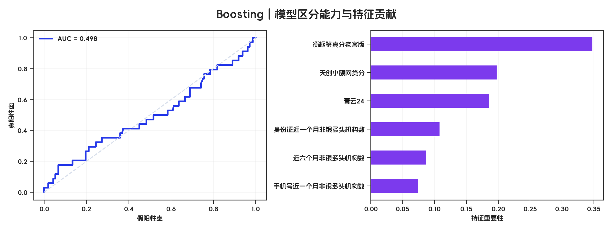</a></p>

#### sklearn 分类模型

```python
from hscredit.core.models import DecisionTreeClassifier, SVM

svm = SVM(C=1.0, kernel="rbf", random_state=42).fit(X_train, y_train)
tree = DecisionTreeClassifier(max_depth=4, min_samples_leaf=20, random_state=42).fit(X_train, y_train)

svm_probability = svm.predict_proba(X_test)[:, 1]
tree_probability = tree.predict_proba(X_test)[:, 1]
```

#### `ScoreCard`

<details>
<summary>代码示例：<code>ScoreCard</code></summary>

```python
from hscredit.core.binning import OptimalBinning
from hscredit.core.models import ScoreCard

binner = OptimalBinning(method="best_iv", max_n_bins=5)
binner.fit(X_train, y_train)
X_train_woe = binner.transform(X_train, metric="woe")

scorecard = ScoreCard(binner=binner, base_score=650, pdo=50)
scorecard.fit(X_train_woe, y_train)
scores = scorecard.predict(X_test)
score_table = scorecard.export(to_frame=True)
```

</details>

| 统计项 | 测试集评分 |
|:---|---:|
| 最低分 | `354.73` |
| 中位数 | `541.63` |
| 平均分 | `532.06` |
| 最高分 | `594.99` |

<p align="center"><a href="docs/assets/readme/api-gallery/model-scorecard.png">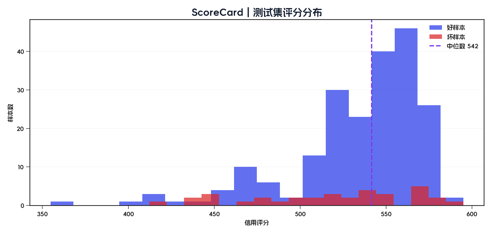</a></p>

#### `RulesClassifier`

<details>
<summary>代码示例：<code>RulesClassifier</code></summary>

```python
from hscredit.core.models import RulesClassifier
from hscredit.core.rules import Rule

rules = [
    Rule("青云24 < 580", name="评分偏低"),
    Rule("近六个月非银多头机构数 >= 55", name="多头偏高"),
]
classifier = RulesClassifier(rules=rules, logic="or", output_mode="final")
classifier.fit(X_train, y_train)
prediction, reason = classifier.predict(X_test, return_reason=True)
```

</details>

| 青云24 | 六月多头数 | 预测 | 命中原因 |
|---:|---:|---:|:---|
| `597` | `50` | `0` | 规则组合结果 |
| `611` | `60` | `1` | 规则组合命中 |
| `543` | `61` | `1` | 规则组合命中 |
| `549` | `79` | `1` | 规则组合命中 |

#### 自定义 Loss

内置 Focal、利润、通过率、坏账、Top-K 捕获及 `AmountWeightedLoss` 等风控目标，并提供 XGBoost、LightGBM、CatBoost、NGBoost 适配器。

<details>
<summary>代码示例：<code>FocalLoss</code> 与框架适配器</summary>

```python
from hscredit.core.models.losses import FocalLoss

loss = FocalLoss(alpha=0.25, gamma=2.0)
xgb_objective = loss.to_xgboost()
lgb_objective = loss.to_lightgbm()
catboost_objective = loss.to_catboost()
ngboost_score = loss.to_ngboost()
```

</details>

<p align="center"><a href="docs/assets/readme/api-gallery/model-custom-loss.png">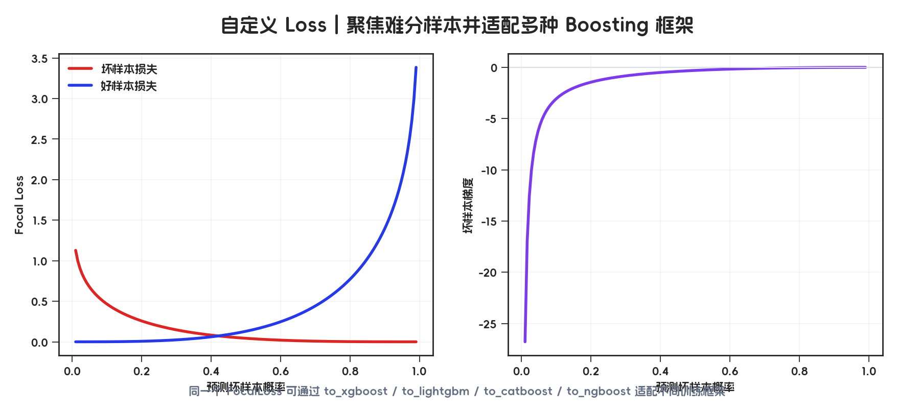</a></p>

#### `ModelTuner`：搜索框架无缝切换 + 自定义评价方法

同一个调优入口接受多种原生搜索空间声明，并统一进入采样、交叉验证和业务评价流程：

<details>
<summary>代码示例：<code>ModelTuner</code></summary>

```python
from sklearn.linear_model import LogisticRegression
from hscredit import ModelTuner, Real, loguniform, suggest_float


def approval_quality(y_true, y_prob, approval_rate=0.4):
    approved = np.asarray(y_true)[
        np.asarray(y_prob) <= np.quantile(y_prob, approval_rate)
    ]
    return 1.0 - approved.mean()


search_spaces = {
    "optuna": {"C": suggest_float("C", 0.1, 1.0, log=True)},
    "grid": {"C": [0.1, 0.3, 1.0]},
    "scikit-optimize": [Real(0.1, 1.0, prior="log-uniform", name="C")],
    "bayesian-optimization": {"C": (0.1, 1.0, float)},
    "hyperopt": {"C": loguniform("C", np.log(0.1), np.log(1.0))},
}

tuner = ModelTuner(
    LogisticRegression,
    search_space=search_spaces["optuna"],  # 切换 key 即可更换搜索空间声明
    metric=approval_quality,
    direction="maximize",
    cv=5,
)
best_params = tuner.fit(X_train, y_train, n_trials=50)
```

</details>

| 搜索空间声明 | 统一后端 | 自定义评价 | 最优 C | solver | 最佳得分 |
|:---|:---:|:---|---:|:---:|---:|
| Optuna | Optuna | 审批客群质量 | `1.0` | liblinear | `0.8667` |
| GridSearch | Optuna | 审批客群质量 | `1.0` | liblinear | `0.8667` |
| scikit-optimize | Optuna | 审批客群质量 | `1.0` | liblinear | `0.8667` |
| bayesian-optimization | Optuna | 审批客群质量 | `1.0` | liblinear | `0.8667` |
| Hyperopt | Optuna | 审批客群质量 | `1.0` | liblinear | `0.8667` |

### 7. Excel：从 DataFrame 到可评审报告

<details>
<summary>代码示例：<code>dataframe2excel</code></summary>

```python
from hscredit.excel import ExcelWriter, dataframe2excel

writer = ExcelWriter()
dataframe2excel(
    monitor_table,
    writer,
    sheet_name="监控摘要",
    title="经营与模型监控摘要",
    percent_cols=["MOB1_DPD7率", "当前DPD30率"],
    auto_width=True,
)
writer.save("风控监控报告.xlsx")
```

</details>

<details>
<summary>代码示例：<code>condition_cols</code></summary>

```python
from hscredit.excel import ExcelWriter, dataframe2excel

writer = ExcelWriter()
dataframe2excel(
    monitor_table,
    writer,
    sheet_name="条件格式",
    percent_cols=["MOB1_DPD7率"],
    condition_cols=["MOB1_DPD7率"],
    condition_color="F76E6C",
    auto_width=True,
)
writer.save("条件格式.xlsx")
```

</details>

<details>
<summary>代码示例：<code>color_cols</code></summary>

```python
from hscredit.excel import ExcelWriter, dataframe2excel

writer = ExcelWriter()
dataframe2excel(
    monitor_table,
    writer,
    sheet_name="色阶格式",
    percent_cols=["当前DPD30率"],
    color_cols=["当前DPD30率"],
    auto_width=True,
)
writer.save("色阶格式.xlsx")
```

</details>

<details>
<summary>代码示例：<code>percent_cols</code></summary>

```python
from hscredit.excel import dataframe2excel

dataframe2excel(
    monitor_table,
    "百分比.xlsx",
    sheet_name="风险指标",
    percent_cols=["MOB1_DPD7率", "当前DPD30率"],
    auto_width=True,
)
```

</details>

<details>
<summary>代码示例：<code>ExcelWriter.set_freeze_panes</code></summary>

```python
from hscredit.excel import ExcelWriter, dataframe2excel

writer = ExcelWriter()
dataframe2excel(monitor_table, writer, sheet_name="监控明细", auto_width=True)
writer.set_freeze_panes("监控明细", "C5")
writer.save("冻结窗口.xlsx")
```

</details>

<details>
<summary>代码示例：<code>ExcelWriter.insert_hyperlink2sheet</code></summary>

```python
from hscredit.excel import ExcelWriter, dataframe2excel

writer = ExcelWriter()
dataframe2excel(
    monitor_table,
    writer,
    sheet_name="监控明细",
    start_row=4,
    auto_width=True,
)
sheet = writer.workbook["监控明细"]
sheet["B2"] = "跳转到明细表"
writer.insert_hyperlink2sheet(sheet, "B2", sheet="监控明细", target_space="B4")
writer.save("超链接.xlsx")
```

</details>

<details>
<summary>代码示例：<code>ExcelWriter.add_sparkline</code></summary>

```python
from hscredit.excel import ExcelWriter, dataframe2excel

sparkline_table = monitor_table.set_index("月份").T
sparkline_table["折线趋势"] = ""
sparkline_table["盈亏柱状图"] = ""

writer = ExcelWriter()
dataframe2excel(
    sparkline_table,
    writer,
    sheet_name="迷你图",
    start_row=2,
    start_col=2,
    auto_width=True,
    index=True,
)
sheet = writer.workbook["迷你图"]
for row in range(5, 5 + len(sparkline_table)):
    writer.add_sparkline(
        sheet, f"G{row}", f"C{row}:F{row}",
        type="line", series_color="2639E9", markers=True,
    )
    writer.add_sparkline(
        sheet, f"H{row}", f"C{row}:F{row}",
        type="win_loss", series_color="2639E9",
        negative_color="F76E6C", negative_points=True,
    )
writer.save("迷你图.xlsx")
```

</details>

ExcelWriter 支持样式、图表、条件格式、数字格式、冻结窗格、超链接、迷你图和自动列宽，可用于生成多 Sheet 分析报告。

<table>
<tr>
<td width="50%" valign="top"><strong><code>dataframe2excel</code></strong><br><sub>DataFrame、数字格式、Figure 与 ExcelWriter 原生自动列宽一次写入。</sub><br><a href="docs/assets/readme/api-gallery/excel-dataframe2excel.png">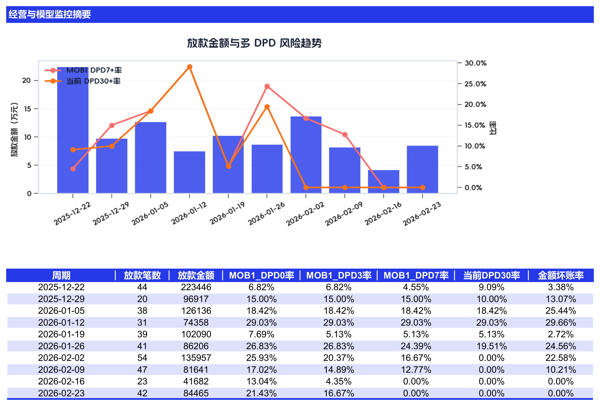</a></td>
<td width="50%" valign="top"><strong>条件格式</strong><br><sub>副主题色数据条与色阶分列展示，避免同一列样式叠加。</sub><br><a href="docs/assets/readme/api-gallery/excel-conditional-formatting.png">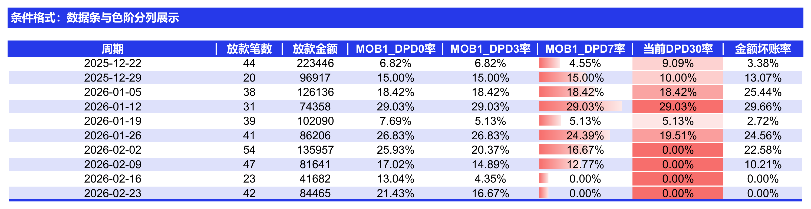</a></td>
</tr>
<tr>
<td width="50%" valign="top"><strong>百分比</strong><br><sub>保持数值类型与业务显示精度。</sub><br><a href="docs/assets/readme/api-gallery/excel-percent-format.png">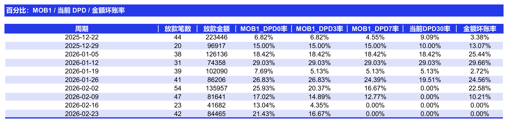</a></td>
<td width="50%" valign="top"><strong>冻结窗口</strong><br><sub>滚动长表时保留标题和定位列。</sub><br><a href="docs/assets/readme/api-gallery/excel-freeze-panes.png">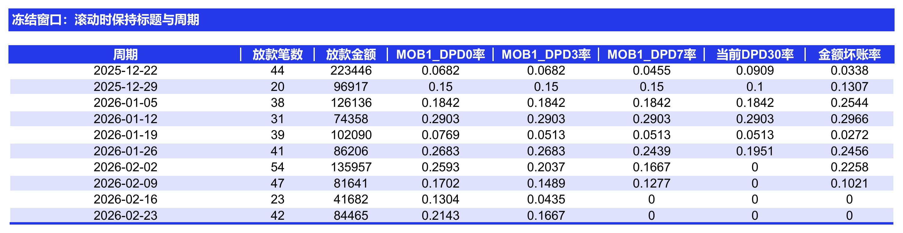</a></td>
</tr>
<tr>
<td width="50%" valign="top"><strong>超链接</strong><br><sub>支持 Sheet 内、跨 Sheet 与在线文档跳转。</sub><br><a href="docs/assets/readme/api-gallery/excel-hyperlink.png">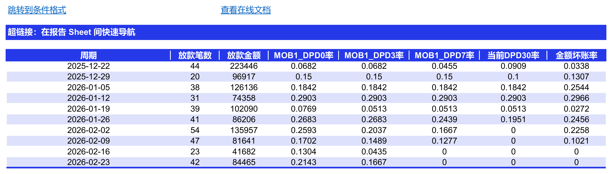</a></td>
<td width="50%" valign="top"><strong>迷你图</strong><br><sub>每一行同时展示趋势折线和盈亏柱；正值使用主题色、负值使用副主题色。</sub><br><a href="docs/assets/readme/api-gallery/excel-sparkline.png">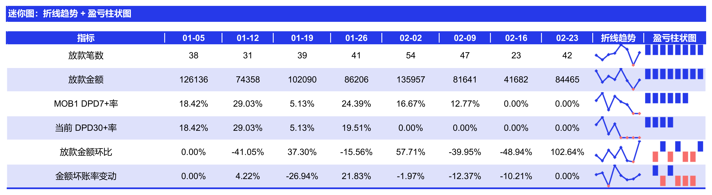</a></td>
</tr>
</table>

## 适用场景

| 场景 | hscredit 能力 | 典型输出 |
|:---|:---|:---|
| 贷前评分卡建模 | IV/WOE、最优/单调分箱、VIF/PSI 筛选、逻辑回归、ScoreCard | 分箱表、评分映射、KS/AUC/Lift、模型报告 |
| 机器学习风控 | RandomForest、DecisionTree、SVM、GBDT、XGBoost、LightGBM、CatBoost、NGBoost、调参、校准 | 模型指标、特征重要性、概率/评分分布、模型制品 |
| 策略规则分析 | Rule、规则挖掘、规则集、命中评估、Swap 置换 | 命中率、坏样本率、Lift、通过率变化、置换报告 |
| 贷后表现分析 | Vintage、Roll Rate、MOB 逾期预测、坏率趋势 | 账龄表现、迁徙矩阵、逾期预测与趋势图 |
| 模型与客群监控 | PSI/CSI、分数漂移、变量漂移、客群迁移 | 稳定性指标、漂移明细、分月和分群监控图 |
| 建模报告交付 | 模型、特征、规则、Swap、ExcelWriter、pandas 扩展 | 中文 DataFrame、PNG 图表、样式化多 Sheet Excel |

## 安装

```bash
pip install hscredit
```

Python 支持范围：**3.9–3.14**。Boosting、深度学习、调参、解释和 PMML 能力可按需安装：

| 安装命令 | 增强能力 |
|:---|:---|
| `pip install hscredit[boost]` | XGBoost、LightGBM、CatBoost、NGBoost |
| `pip install hscredit[net]` | PyTorch、TabNet |
| `pip install hscredit[tune]` | Optuna、调参看板 |
| `pip install hscredit` | 已内置 SHAP 模型解释、特征重要性和单样本分析 |
| `pip install hscredit[pmml]` | PMML 导出与加载 |
| `pip install hscredit[db-mysql]` | MySQL / MariaDB 连接池与流式读写 |
| `pip install hscredit[db-hive]` | HiveServer2 连接池与流式读写 |
| `pip install hscredit[db-impala]` | Impala / Kudu 连接池与流式读写 |
| `pip install hscredit[db-oracle]` | Oracle 原生连接池与流式读写 |
| `pip install hscredit[db-starrocks]` | StarRocks MySQL 协议与 Stream Load |
| `pip install hscredit[db-clickhouse]` | ClickHouse 原生 DataFrame 流式读写 |
| `pip install hscredit[db-maxcompute]` | MaxCompute DB-API、原生写入与元数据 |
| `pip install hscredit[db-redis]` | Redis 连接池与统一 NoSQL 读写 |
| `pip install hscredit[db-mongodb]` | MongoDB 连接池与统一 NoSQL 读写 |
| `pip install hscredit[database-all]` | 全部数据库适配器 |
| `pip install hscredit[all]` | 全部可选能力、开发和文档依赖 |

SHAP 已是基础依赖。可直接使用 `ModelExplainer.explain()` 生成带样本索引、目标类别、输出尺度和数据指纹的结构化结果，并继续下钻全局重要性、单样本贡献、代表样本、交互、稳定性和不利原因码。`CounterfactualExplainer` 提供遵守不可变字段、上下界和变化方向约束的非因果候选建议；`ModelReport` 通过 `explain_config={"enabled": True, ...}` 追加 `7-模型解释`。完整示例见 `examples/27_model_interpretability.py`。

### 数据库连接、流式读写与表结构导出

数据库驱动均为可选依赖；普通 `import hscredit` 不会加载 PyMySQL、Impyla、python-oracledb、clickhouse-connect、PyODPS、redis-py 或 PyMongo。所有连接参数直接交给对应驱动，连接池参数单独放在 `pool_options` 中：

```python
from hscredit import Database

db = Database(
    "mysql",
    host="127.0.0.1",
    port=3306,
    user="risk_user",
    password="从环境变量读取",
    database="risk_db",
    pool_options={
        "mincached": 1,
        "maxcached": 5,
        "maxconnections": 10,
        "blocking": True,
    },
)
```

流式读取默认产生 DataFrame 分块。`progress=False` 不执行额外统计 SQL；启用进度条后，适配器才使用 `COUNT(1)` 查询总数。主动 `stop()` 或读取期间按 `Ctrl+C` 后，可直接合并当前已经读取的数据：

```python
stream = db.stream_query(
    "SELECT * FROM feature_db.user_profile WHERE created_at >= %s",
    params=("2026-01-01",),
    chunksize=50_000,
    progress=True,
)

for chunk in stream:
    consume(chunk)
    if should_stop():
        stream.stop()

partial = stream.to_dataframe()
print(partial.attrs["completed"], partial.attrs["rows_read"])

# 便捷接口会自动消费流；Ctrl+C 后直接返回部分 DataFrame
frame = db.read_query(sql, chunksize=50_000, progress=True)
```

流式写入支持单个 DataFrame、DataFrame 分块迭代器以及行记录迭代器：

| mode | 语义 |
|:---:|:---|
| `a` | 追加；已有主键记录保持不变 |
| `r` | 追加；主键冲突时用新记录覆盖 |
| `o` | 保留表结构，清空数据后重写 |
| `d` | 删除表，根据输入数据重建结构后写入 |

```python
result = db.stream_write(
    dataframe_chunks,
    "feature_db.user_profile",
    mode="r",
    batch_size=10_000,
    key_columns=["user_id"],
)
```

也可以显式建表；`dialect_options` 负责数据库专有的表引擎、分区、排序和生命周期参数。`d` 模式等价于“校验新 DDL → 删除旧表 → 重建 → 写入”，适合希望根据首批数据自动重建结构的场景：

```python
db.create_table(
    first_chunk,
    "feature_db.user_profile",
    dialect_options={
        "key_columns": ["user_id"],
        "engine": "InnoDB",
        "table_comment": "用户特征宽表",
    },
)
```

`column_types` 仅接受由字母、数字、空格及平衡的 `()` / `<>` 组成的安全类型表达式（如 `DECIMAL(18, 2)`、`ARRAY<STRING>`、`Nullable(String)`），不接受引号、注释或 SQL 片段。带引号参数的特殊类型应使用对应数据库适配器的专用方言参数配置。

未显式指定类型时会分析当前建表 DataFrame：短文本使用带余量的自适应 VARCHAR，MySQL 长文本按容量使用 `TEXT/MEDIUMTEXT/LONGTEXT`，Oracle 长文本使用 `CLOB`。只有全部非空字符串都能解析为 JSON 对象或数组时才推断 JSON；混合普通文本会回退字符串类型。各后端规则、版本开关和长度上限见[数据库完整指南](docs/database.md#字符串长度与-json-内容推断)。

流式读取超大 JSON 字段时，可将少量路径直接下推到数据库，避免传输完整 JSON。字段定义使用“JSON 源字段 → 输出字段名 → JSONPath 或 `(JSONPath, 默认值)`”，结果类型继续使用 `dataframe/records/rows`：

```python
records = db.read_query(
    "SELECT id, huge_json FROM user_profile",
    columns=["id"],
    json_fields={
        "huge_json": {
            "customer_id": "$.customer.id",
            "city": ("$.address.city", "未知"),
        }
    },
    result="records",
)
```

`a/r` 仅在数据库和当前表模型可以原生保证冲突语义时开放。例如 Impala Kudu 的 `a` 会保留已有主键行、`r` 使用 UPSERT；StarRocks 主键/唯一键表只支持 `r`，没有可靠冲突忽略能力，因此不开放 `a`；ClickHouse 的 `r` 要求 ReplacingMergeTree 且属于最终一致性。不支持时会抛出中文 `DatabaseCapabilityError`，不会使用并发不安全的客户端“先查再写”替代。

表结构导出按“每个字段一行”返回中文列名 DataFrame，数据库返回值保持原样。可指定整个数据库或 `数据库.表`；Excel 仅通过 `dataframe2excel` 导出，不提供 CSV/TSV：

```python
schema = db.export_schema(
    targets=["risk_db", "feature_db.user_profile"],
    output="数据库表结构.xlsx",
    excel_params={
        "sheet_name": "字段清单",
        "title": "数据库字段信息",
        "auto_width": True,
    },
)

db.close()
```

Redis 与 MongoDB 使用统一的 `read_one/read_many`、`write_one/write_many`、`delete_one/delete_many` 和 `exists` 方法，并提供自适应 `read/write/delete`：

```python
redis_db = Database("redis", url="redis://127.0.0.1:6379/0")
redis_db.write({"score:1": "720", "score:2": "680"})
scores = redis_db.read(["score:1", "score:2"])

mongo_db = Database(
    "mongodb",
    uri="mongodb://127.0.0.1:27017/risk",
    database="risk",
)
mongo_db.write("model_score", {"user_id": 1, "score": 720})
documents = mongo_db.read("model_score", {"score": {"$gte": 700}})
mongo_db.delete("model_score", {"user_id": 1})  # 默认只删除一个匹配文档
```

MongoDB 的 `read()` 默认返回列表，`limit=1` 或 `many=False` 返回单个文档；`write()` 根据单个映射或文档序列自动选择单条/批量写入；`delete()` 默认单条，批量删除必须显式设置 `many=True`。完整连接池参数、更新/替换模式和安全删除规则见[数据库完整指南](docs/database.md#redis-与-mongodb-的统一-nosql-方法)。

第三方数据库通过适配器注册表扩展，注册动作不会加载其他内置数据库驱动：

```python
from hscredit import register_adapter

register_adapter("custom_db", CustomDatabaseAdapter, aliases=("custom",))
custom = Database("custom", endpoint="https://database.example")
```

## 5 分钟上手

仓库提供不依赖外部数据的可执行示例，覆盖时间切分、分箱、筛选、评分卡、机器学习、规则挖掘和模型报告：

```bash
git clone https://github.com/hengshu-credit/hscredit.git
cd hscredit
pip install -e .
python examples/00_quickstart.py
```

导入 `hscredit` 后会注册 pandas 扩展；既可以使用 sklearn 风格的 `(X, y)`，也可以从含目标列的 DataFrame 开始：

```python
import hscredit

# 数据摘要：返回中文指标表，可继续保存或展示
summary = df.summary(y="target")
summary.save("数据质量摘要.xlsx", title="数据概览")

# 常规 DataFrame 也可以直接输出为样式化 Excel
bin_table.save("分箱结果.xlsx", title="变量分箱")
```

## 模块能力矩阵

| 模块 | 主要内容 | 使用入口 | 典型输出 |
|:---|:---|:---|:---|
| 数据探索 `eda` | 数据质量、目标分析、坏率趋势、Vintage、Roll Rate、客群与漂移 | `hscredit.core.eda`、`df.summary()` | DataFrame、报告字典、Figure、Excel |
| 分箱 `binning` | 18 种一维/二维分箱，用户切点、单调和最小样本约束 | `OptimalBinning`、各独立分箱器 | 分箱规则、WOE 数据、分箱统计与图表 |
| 编码 `encoders` | WOE、Target、Count、OneHot、Ordinal、Quantile、CatBoost/GBM | `WOEEncoder` 等 sklearn Transformer | 编码后的 DataFrame、可序列化编码器 |
| 筛选 `selectors` | 23 种单项与组合筛选，支持筛选报告汇总 | `IVSelector`、`VIFSelector`、`CompositeFeatureSelector` | 入选变量、淘汰原因、中文筛选报告 |
| 模型 `models` | ScoreCard、树模型、SVM、Boosting、概率校准、风控损失、调参 | `ScoreCard`、`RandomForest`、`DecisionTreeClassifier`、`SVM`、Boosting 模型 | 预测概率/评分、评估指标、模型制品 |
| 指标 `metrics` | `ks`、`auc`、`gini`、`iv`、`psi`、`csi`、`lift`、回归指标 | `hscredit.core.metrics` | 标量指标、分箱/稳定性明细表 |
| 可视化 `viz` | 模型、分箱、评分、规则、稳定性、Vintage 与树图 | `hscredit.core.viz` | Matplotlib Figure、Pyecharts 图表、PNG/SVG |
| 规则 `rules` | Rule 表达式、逻辑组合、规则集分类器、树规则 | `Rule`、`RuleFlow`、`hscredit.core.models.RulesClassifier` | 命中标记、规则报告、规则树与策略结果 |
| 报告 `report` | 模型、特征、规则、Swap、逾期预测、模型对比 | `auto_model_report`、`feature_bin_stats`、`rule_swap_analysis` | 中文 DataFrame、报告字典、多 Sheet Excel |
| Excel `excel` | 样式、图片、条件格式、超链接、数字格式、模板化写入 | `ExcelWriter`、`dataframe2excel`、`df.save()` | 样式化 `.xlsx` 工作簿 |
| 金融计算 `financial` | FV/PV/PMT/NPER、NPV/IRR/MIRR 等 | `hscredit.core.financial` | 现金流、现值终值与收益率结果 |
| 特征工程 `feature_engineering` | numexpr 表达式衍生、条件逻辑与数学函数 | `NumExprDerive` | 可进入 Pipeline 的派生特征 DataFrame |

## 文档与示例

- [在线文档](https://hscredit.hengshucredit.com/)
- [可执行快速开始](examples/00_quickstart.py)
- [完整示例与 Notebook](examples/)
- [项目迭代规划](docs/ROADMAP.md)
- [问题反馈](https://github.com/hengshu-credit/hscredit/issues)

<details>
<summary>参与开发与本地验证</summary>

```bash
git clone https://github.com/hengshu-credit/hscredit.git
cd hscredit
pip install -e ".[dev]"
pytest tests/ -m "not slow and not integration"
```

项目版本唯一来源是 `hscredit/__init__.py` 中的 `__version__`；依赖和可选能力统一维护在 `pyproject.toml`。

</details>

## 联系方式

邮箱：`hscredit@hengshucredit.com`

| 微信 | 微信公众号 |
|:---:|:---:|
|  |  |
| `itlubber` | `hengshucredit-com` |

关注公众号 **衡枢风控**，回复 `入群` 加入 hscredit 技术交流群。

## 许可证

[MIT License](LICENSE)。可按许可证条款用于商业和非商业场景。
